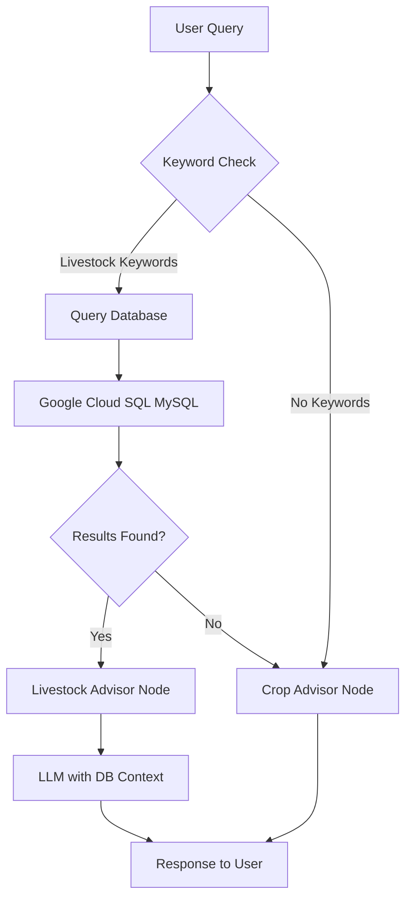

# Livestock Breed Tool Implementation Plan

## Overview

Enhance the existing agricultural assistant to support livestock breed queries by integrating with a Google Cloud SQL (MySQL) database. The system will automatically detect livestock-related queries, retrieve relevant breed information from the database, and provide context to the LLM for accurate responses.

## Architecture

The implementation follows this flow:



## Implementation Steps

### 1. Database Connection Module (`database.py`)

- Create a new module for Google Cloud SQL connection
- Use SQLAlchemy with MySQL driver (PyMySQL or mysql-connector-python)
- Support connection via service account credentials (reuse existing Google Cloud auth)
- Implement connection pooling for performance
- Add error handling and retry logic

**Key Functions:**

- `get_db_connection()`: Initialize and return database connection
- `discover_schema()`: Query INFORMATION_SCHEMA to discover table/column names (if schema unknown)
- `get_schema_info()`: Return schema information (table names, columns) - either from config or discovery
- `build_query(user_query: str, schema_info: dict)`: Use LLM to construct SQL query from user query + schema info
- `query_livestock_breeds(query_text: str)`: Search database for relevant breed information
- `format_breed_results(results)`: Format database results for LLM context

### 2. Efficient Router Function (`main.py`)

- Add a lightweight `is_livestock_query()` function using keyword matching (NO LLM call)
- Check for livestock-related keywords: "cattle", "cow", "breed", "livestock", "animal", "sheep", "goat", "pig", "chicken", etc.
- Update `AdvisorState` to include `query_type` and `db_context`
- Modify graph to include conditional routing based on keyword detection
- **Efficiency**: Zero LLM calls for routing - just fast string matching

**State Updates:**

```python
class AdvisorState(TypedDict, total=False):
    history: List[str]
    advice: Optional[str]
    query_type: Optional[str]  # "crop", "livestock", or "general"
    db_context: Optional[str]   # Retrieved database information
```

### 3. Livestock Advisor Node (`main.py`)

- Create `livestock_advisor_node()` function
- **Get schema information** (from config or discover from database)
- **Use LLM to build SQL query** from user query + schema information (one-time LLM call per query)
- Execute SQL query against database
- Format retrieved data as context for LLM
- Generate responses using structured output (similar to existing crop advisor)
- Support Q&A flow for livestock queries (similar to crop advisor pattern)

**Query Building Approach:**

- LLM receives: user query + database schema (table names, column names, data types)
- LLM generates: SQL query string
- System executes: SQL query safely (with parameterization to prevent SQL injection)
- Results: Passed back to LLM for response generation

### 4. Graph Updates (`main.py`)

- Update StateGraph to include:
  - Conditional routing function (keyword-based, no node needed)
  - Conditional edges: START → crop_advisor OR livestock_advisor (based on keyword check)
  - Both paths converge to END
- **Optimization**: Routing happens in the initial node, avoiding extra graph nodes

### 5. API Updates (`api.py`)

- No changes needed - existing `/chat` endpoint will handle both types
- The routing happens automatically in the LangGraph workflow

### 6. Dependencies (`requirements.txt`)

- Add `sqlalchemy>=2.0.0`
- Add `pymysql>=1.1.0` or `mysql-connector-python>=8.0.0`
- Add `google-cloud-sql-connector` (optional, for Cloud SQL Proxy)

### 7. Environment Configuration (`.env`)

- Add database connection variables:
  - `DB_HOST`: Google Cloud SQL instance connection name
  - `DB_NAME`: Database name
  - `DB_USER`: Database user
  - `DB_PASSWORD`: Database password (or use IAM authentication)
  - `DB_PORT`: Port (default 3306 for MySQL)

**Optional Schema Configuration** (if schema is known):

  - `LIVESTOCK_TABLE_NAME`: Main table name (e.g., "breeds", "livestock_breeds")
  - `LIVESTOCK_COLUMNS`: Comma-separated column names (e.g., "id,name,animal_type,description")
  - If not provided, system will auto-discover schema from INFORMATION_SCHEMA

### 8. Documentation Updates (`README.md`)

- Document the unified advisor approach
- Add database configuration instructions
- Explain the routing mechanism
- Add examples of livestock queries
- Document database schema requirements (if known)

## Key Files to Modify

1. **[main.py](main.py)**: Add router function, livestock advisor node, update graph structure
2. **[api.py](api.py)**: No changes needed (existing endpoint handles both)
3. **[requirements.txt](requirements.txt)**: Add database dependencies
4. **[README.md](README.md)**: Update documentation
5. **New: [database.py](database.py)**: Database connection, schema discovery, and query functions

## Schema Discovery & Query Building

**Two Approaches:**

### Approach 1: Known Schema (Recommended if schema is fixed)

- Hardcode table/column names in `database.py` or config
- Fastest, most reliable
- Example: `LIVESTOCK_TABLE_NAME=breeds` in `.env`

### Approach 2: Auto-Discovery (Flexible, works with any schema)

- Query `INFORMATION_SCHEMA` to discover tables/columns
- Cache schema info to avoid repeated discovery
- Works even if schema changes

**Query Building with LLM:**

- **Input to LLM**: 
  - User's natural language query
  - Database schema (table names, column names, data types)
  - Example: "User wants: 'Tell me about Holstein cattle'. Schema: Table 'breeds' has columns: id, name, animal_type, description"
- **Output from LLM**: SQL query string
- **Safety**: Use parameterized queries to prevent SQL injection
- **Validation**: Check query is SELECT only (read-only)

## Database Query Strategy

The system will:

1. **Fast Keyword Detection**: Check query for livestock keywords (no LLM call)
2. **Schema Discovery/Retrieval**: Get table/column names (from config or INFORMATION_SCHEMA)
3. **LLM Query Builder**: Use LLM to construct SQL query from user query + schema info
4. **Execute Query**: Safely execute SQL query with parameterization
5. **Format Results**: Format retrieved data as context for LLM
6. **Generate Response**: LLM uses database context to generate accurate response

**Example Query Flow:**

- User: "Tell me about Holstein cattle"
- Keyword check: "cattle" detected → livestock path
- Schema info retrieved: `{tables: ["breeds"], columns: ["id", "name", "animal_type", "description", "characteristics"]}`
- LLM builds query: Receives user query + schema, generates: `SELECT * FROM breeds WHERE name LIKE '%Holstein%' OR animal_type = 'cattle'`
- System executes: SQL query safely (parameterized)
- Retrieved data: `[{name: "Holstein", animal_type: "cattle", description: "..."}]`
- LLM generates response: Uses database information to provide accurate answer

**Why LLM for Query Building:**

- LLM understands natural language intent ("tell me about" = SELECT with WHERE)
- LLM can handle variations: "Holstein", "Holstein cattle", "Holstein breed"
- Schema is provided to LLM, so it knows exact table/column names
- One LLM call to build query, then direct SQL execution (fast)

**Routing Efficiency:**

- **No LLM call for routing** - saves cost and latency
- Simple keyword matching: `["cattle", "cow", "breed", "livestock", "animal", "sheep", "goat", "pig", "chicken", "poultry", "horse", "donkey", "buffalo"]`
- If no keywords match, default to crop advisor (existing behavior)

## Error Handling

- Database connection failures: Graceful fallback, inform user
- No results found: LLM responds that no matching breeds found
- Query parsing errors: Log and provide generic response
- Timeout handling: Set reasonable query timeouts

## Testing Considerations

- Test keyword-based routing accuracy (crop vs livestock detection)
- Test edge cases (queries with both crop and livestock terms)
- Test database connection and queries
- Test LLM responses with database context
- Test error scenarios (DB down, no results, etc.)
- Verify no extra LLM calls are made for routing (performance check)

## Efficiency Benefits

**Why Keyword-Based Routing is Better:**

1. **Zero LLM Cost for Routing**: No extra API calls = lower costs
2. **Faster Response Time**: String matching is instant vs LLM call (saves ~500ms-2s)
3. **Simpler Architecture**: No need for separate router node in graph
4. **Reliable**: Keyword matching is deterministic, no ambiguity
5. **Easy to Maintain**: Simple list of keywords, easy to update

**Performance Comparison:**

- LLM Router: ~1-2 seconds + cost per query
- Keyword Router: <1ms, zero cost

**LLM Usage Summary:**

- **Routing**: 0 LLM calls (keyword-based)
- **Query Building**: 1 LLM call (to build SQL from user query + schema)
- **Response Generation**: 1 LLM call (to generate answer with DB context)
- **Total**: 2 LLM calls per livestock query (vs 1 for crop queries)

**Fallback Strategy:**

- If keywords suggest livestock but DB query returns no results → fall back to crop advisor
- This handles edge cases without needing LLM routing

## Future Enhancements (Out of Scope)

- Caching frequently queried breeds
- Vector search for semantic breed matching
- Multi-table joins for comprehensive breed information
- Learning from user queries to improve keyword list