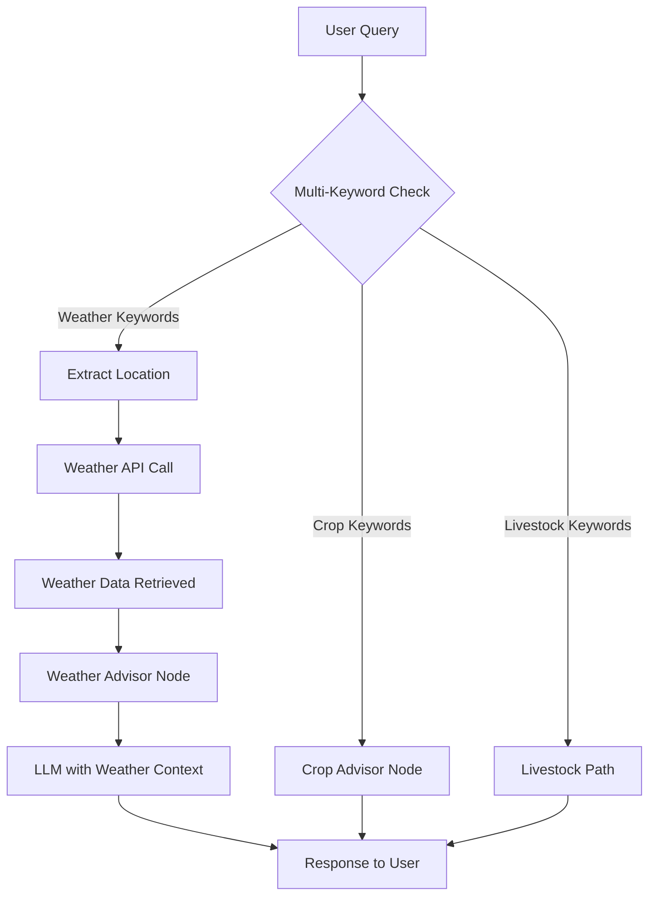

# Weather Tool Implementation Plan

## Overview

Enhance the existing agricultural assistant to support weather queries by integrating with a weather API (OpenWeatherMap recommended). The system will automatically detect weather-related queries, extract location information, fetch real-time weather data, and provide context to the LLM for accurate, location-specific responses.

## Architecture



## Implementation Steps

### 1. Weather API Module (`weather.py`)

- Create a new module for weather API integration
- Support OpenWeatherMap API (most popular, free tier available)
- Alternative: WeatherAPI.com, AccuWeather, or other providers
- Implement location extraction from user queries
- Add error handling and retry logic
- Support caching to reduce API calls (optional)

**Key Functions:**

- `get_weather_api_client()`: Initialize weather API client with API key
- `extract_location(query: str)`: Use LLM to extract location from natural language query
- `get_current_weather(location: str)`: Fetch current weather data
- `get_weather_forecast(location: str, days: int)`: Fetch weather forecast
- `format_weather_data(weather_data: dict)`: Format weather data for LLM context

**Example Weather Data Structure:**
```python
{
    "location": "Boston, MA",
    "temperature": 72,
    "condition": "Partly Cloudy",
    "humidity": 65,
    "wind_speed": 10,
    "precipitation": 0,
    "forecast": [...]
}
```

### 2. Efficient Router Function (`main.py`)

- Add `is_weather_query()` function using keyword matching (NO LLM call)
- Check for weather-related keywords: "weather", "temperature", "rain", "forecast", "climate", "humidity", "wind", "sunny", "cloudy", etc.
- Update `AdvisorState` to include `weather_context`
- Modify graph to include weather routing alongside existing routing

**State Updates:**

```python
class AdvisorState(TypedDict, total=False):
    history: List[str]
    advice: Optional[str]
    query_type: Optional[str]  # "crop", "livestock", "weather", or "general"
    db_context: Optional[str]   # Retrieved database information (livestock)
    weather_context: Optional[str]  # Retrieved weather information
```

### 3. Weather Advisor Node (`main.py`)

- Create `weather_advisor_node()` function
- Extract location from user query using LLM (if not explicitly provided)
- Fetch weather data using `weather.py` functions
- Format weather data as context for LLM
- Generate responses using structured output (similar to existing crop advisor)
- Support Q&A flow for weather queries (e.g., "What about tomorrow?")

**Location Extraction:**
- Use LLM to extract location from natural language
- Examples:
  - "What's the weather in Boston?" → "Boston"
  - "How's the weather today?" → Use default location or ask user
  - "Weather forecast for New York" → "New York"
- Fallback: If location unclear, ask user for location

### 4. Graph Updates (`main.py`)

- Update StateGraph to include:
  - Multi-way conditional routing: START → crop_advisor OR livestock_advisor OR weather_advisor
  - All paths converge to END
- **Optimization**: Routing happens in the initial node, avoiding extra graph nodes

**Routing Priority:**
1. Weather keywords → weather advisor
2. Livestock keywords → livestock advisor  
3. Crop keywords → crop advisor
4. Default → crop advisor (existing behavior)

### 5. API Updates (`api.py`)

- No changes needed - existing `/chat` endpoint will handle all types
- The routing happens automatically in the LangGraph workflow

### 6. Dependencies (`requirements.txt`)

- Add `pyowm>=3.3.0` (OpenWeatherMap Python client) OR
- Add `requests>=2.31.0` (for direct API calls)
- Optional: `python-weather>=1.0.0` (alternative weather library)

### 7. Environment Configuration (`.env`)

- Add weather API configuration:
  - `WEATHER_API_KEY`: API key for weather service (OpenWeatherMap, WeatherAPI, etc.)
  - `WEATHER_API_PROVIDER`: Provider name (default: "openweathermap")
  - `DEFAULT_LOCATION`: Default location if user doesn't specify (optional)
  - `WEATHER_CACHE_TTL`: Cache duration in seconds (optional, default: 300 = 5 minutes)

**OpenWeatherMap Setup:**
1. Sign up at https://openweathermap.org/api
2. Get free API key (1000 calls/day)
3. Add to `.env`: `WEATHER_API_KEY=your_key_here`

### 8. Documentation Updates (`README.md`)

- Document the unified advisor approach (crop + livestock + weather)
- Add weather API configuration instructions
- Explain the multi-tool routing mechanism
- Add examples of weather queries
- Document API rate limits and caching strategy

## Key Files to Modify

1. **[main.py](main.py)**: Add weather router function, weather advisor node, update graph structure
2. **[api.py](api.py)**: No changes needed (existing endpoint handles all)
3. **[requirements.txt](requirements.txt)**: Add weather API dependencies
4. **[README.md](README.md)**: Update documentation
5. **New: [weather.py](weather.py)**: Weather API integration and location extraction functions

## Weather Query Strategy

The system will:

1. **Fast Keyword Detection**: Check query for weather keywords (no LLM call)
2. **Location Extraction**: Use LLM to extract location from natural language query
3. **API Call**: Fetch weather data from weather API
4. **Format Data**: Format weather data as context for LLM
5. **Generate Response**: LLM uses weather context to generate accurate, location-specific response

**Example Query Flow:**

- User: "What's the weather like in Boston today?"
- Keyword check: "weather" detected → weather path
- Location extraction: LLM extracts "Boston" from query
- API call: `get_current_weather("Boston")`
- Weather data retrieved: `{temperature: 72, condition: "Partly Cloudy", ...}`
- LLM generates response: Uses weather data to provide accurate answer

**Routing Efficiency:**

- **No LLM call for routing** - saves cost and latency
- Simple keyword matching: `["weather", "temperature", "rain", "forecast", "climate", "humidity", "wind", "sunny", "cloudy", "storm", "snow"]`
- If no keywords match, default to crop advisor (existing behavior)

## Location Extraction Strategy

**Approach 1: LLM-Based Extraction (Recommended)**
- Use LLM to extract location from natural language
- Handles variations: "Boston", "Boston, MA", "in Boston", "for Boston"
- Can infer context: "here" → use default location, "there" → ask for clarification

**Approach 2: Pattern Matching (Fallback)**
- Simple regex patterns for common formats
- Less flexible but faster
- Use if LLM extraction fails

**Location Handling:**
- Explicit location: "weather in Boston" → use Boston
- Implicit location: "what's the weather?" → use default or ask user
- Ambiguous: "weather there" → ask for clarification

## Error Handling

- Weather API failures: Graceful fallback, inform user
- Invalid location: Ask user to clarify location
- API rate limits: Implement caching and rate limit handling
- Network timeouts: Retry logic with exponential backoff
- Missing API key: Clear error message with setup instructions

## Caching Strategy

- Cache weather data for 5-10 minutes (configurable)
- Reduce API calls for repeated queries
- Cache key: `location + timestamp`
- Invalidate cache after TTL expires

## Testing Considerations

- Test keyword-based routing accuracy (weather vs crop vs livestock detection)
- Test location extraction from various query formats
- Test weather API integration and error handling
- Test LLM responses with weather context
- Test error scenarios (API down, invalid location, etc.)
- Test caching behavior
- Verify no extra LLM calls are made for routing (performance check)

## Efficiency Benefits

**Why Keyword-Based Routing is Better:**

1. **Zero LLM Cost for Routing**: No extra API calls = lower costs
2. **Faster Response Time**: String matching is instant vs LLM call (saves ~500ms-2s)
3. **Simpler Architecture**: No need for separate router node in graph
4. **Reliable**: Keyword matching is deterministic, no ambiguity
5. **Easy to Maintain**: Simple list of keywords, easy to update

**LLM Usage Summary:**

- **Routing**: 0 LLM calls (keyword-based)
- **Location Extraction**: 1 LLM call (extract location from query)
- **Response Generation**: 1 LLM call (generate answer with weather context)
- **Total**: 2 LLM calls per weather query

**Performance Comparison:**

- LLM Router: ~1-2 seconds + cost per query
- Keyword Router: <1ms, zero cost

**Fallback Strategy:**

- If keywords suggest weather but location unclear → ask user for location
- If weather API fails → inform user and suggest retrying later
- If no weather keywords match → default to crop advisor

## API Provider Options

### Option 1: OpenWeatherMap (Recommended)
- **Free Tier**: 1,000 calls/day
- **Cost**: Free for basic usage
- **Features**: Current weather, forecast, historical data
- **Setup**: Sign up at openweathermap.org, get API key

### Option 2: WeatherAPI.com
- **Free Tier**: 1 million calls/month
- **Cost**: Free tier available
- **Features**: Current weather, forecast, astronomy data
- **Setup**: Sign up at weatherapi.com

### Option 3: AccuWeather
- **Free Tier**: Limited
- **Cost**: Paid plans available
- **Features**: Detailed forecasts, alerts
- **Setup**: More complex, requires business account

## Future Enhancements (Out of Scope)

- Weather alerts and notifications
- Historical weather data analysis
- Weather impact on crops/livestock recommendations
- Multi-location weather comparisons
- Weather-based agricultural advice (e.g., "Is it a good day to plant?")
- Integration with crop advisor for weather-dependent recommendations

## Integration with Existing Tools

The weather tool will work alongside:
- **Crop Advisor**: Can provide weather context for crop-related queries
- **Livestock Advisor**: Can provide weather context for livestock-related queries
- **Unified Experience**: Users can ask "What's the weather and how does it affect my crops?"

**Example Combined Query:**
- User: "What's the weather in Boston and should I water my crops today?"
- System: Routes to weather advisor, gets weather data, then provides crop advice with weather context

